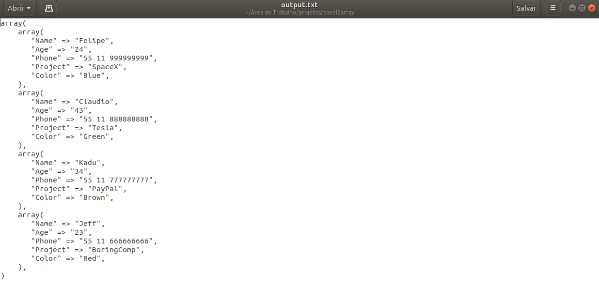

# Excel_2_Array

A short script capable of reading an excel file and generating a txt file with PHP array format.

# Usage
```
python excel2array.py -i <inputFileName.xls> -o <outputFileName.txt>

```

## How does it look like?

### Input file


### Output file


## Requirements
pandas
<br>sys
<br>getopt
